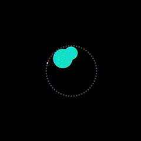
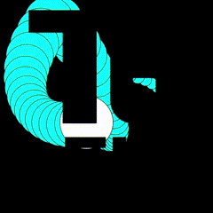
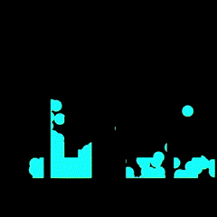
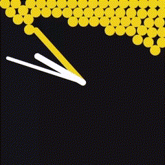
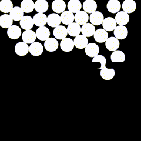
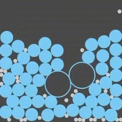
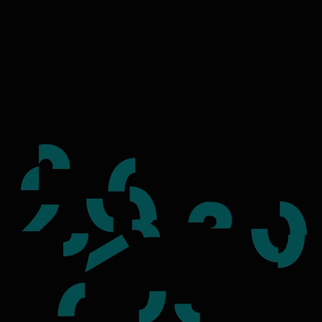
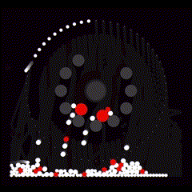

# Watchfaces

<strong>Programmiertes Entwerfen 1</strong> 
Interaktionsgestaltung 
Wintersemester 2024/25 
1. Semester

<strong>Studierende</strong> 
IG 1

<strong>Betreuende</strong> 
Prof. Benedikt Groß 
Prof. Andreas Pollok 
Benno Stäbler

  

  

    
    
Floating Geometry

  

  

    
    
Scratch Card

  

  

    
    
Zeitfluss

  

  

    
    
Bubbles

  

  

    
    
New Time

  

  

    
    
Ball Fall

  

  

    
    
Bubble Trouble

  

  

    
    
Blubberblasen

  

  

    
    
⁠Käse

  

  

    
    
⁠Bällebad

  

  

    
    
⁠Zeigermodell

  

  

    
    
Waves

  

  

    
    
Web

  

  

    
    
Segments Clock

  

  

    
    
Free Palestine

  

  

    
    
Magnet Flowers

  

  

    
    
Reversed Falling

  

