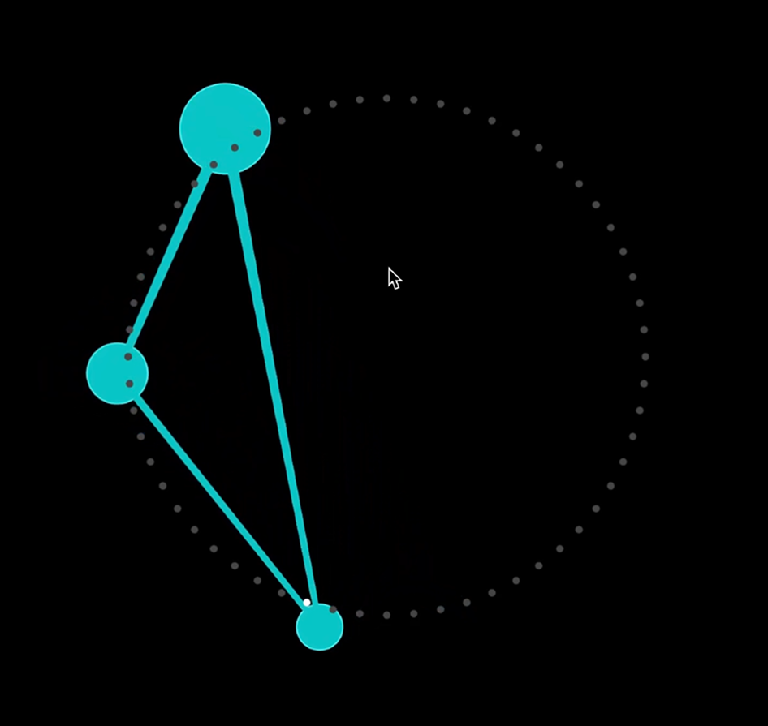

  

    
    
Floating Geometry

  

  

    
    
Scratch Card

  

  

    
    
Zeitfluss

  

  

    
    
Bubbles

  

  

    
    
New Time

  

  

    
    
Ball Fall

  

  

    
    
Bubbele Trouble

  

