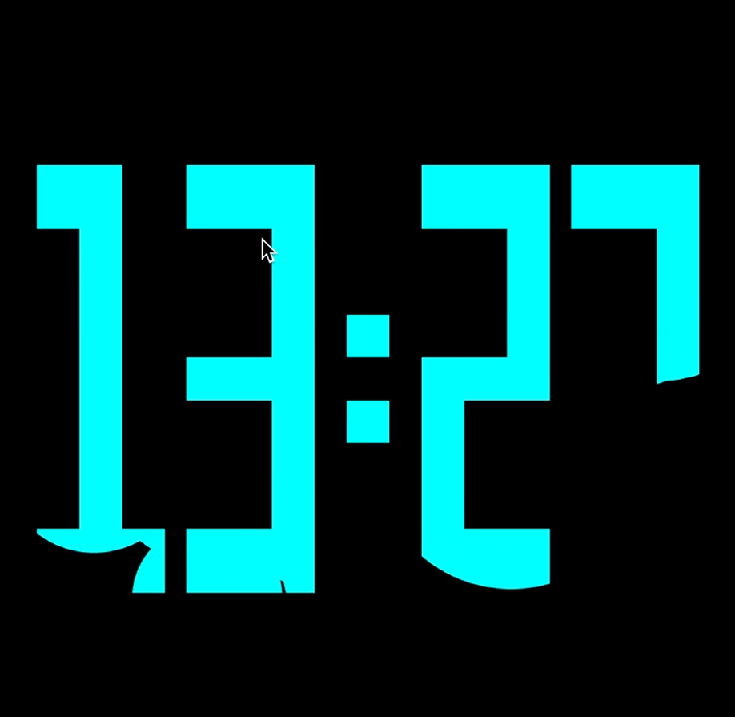

# Watchfaces

  

    
    
Watchface 1

  

  

    
    
Watchface 2

  

  

    
    
Watchface 3

  

  

    
    
Watchface 4

  

## 关于

这些示例源自于课程 *Programmiertes Entwerfen (Sketching with Code)*，由 [HfG Schwäbisch Gmünd](https://www.hfg-gmuend.de/) 的 [Benedikt Groß](https://benedikt-gross.de/)、Benno Stäbler 和 [Stephan Bogner](https://stephanbogner.de/) 教授。

一些示例基于 [matter.js demos](http://brm.io/matter-js/demo) 和 [p5-matter](https://github.com/shiffman/p5-matter)。
